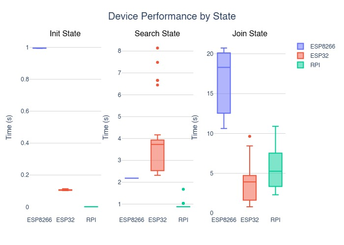
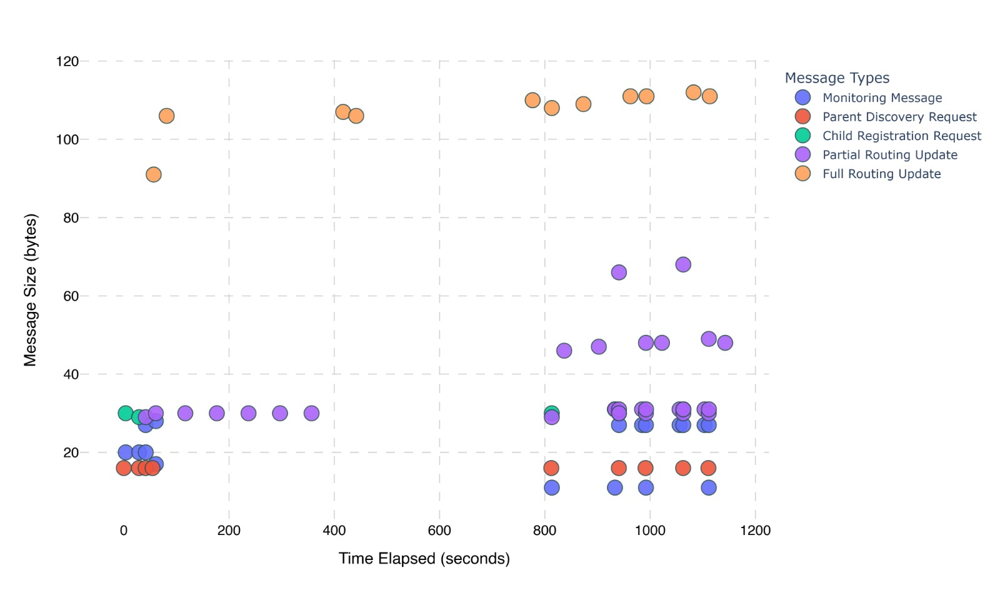
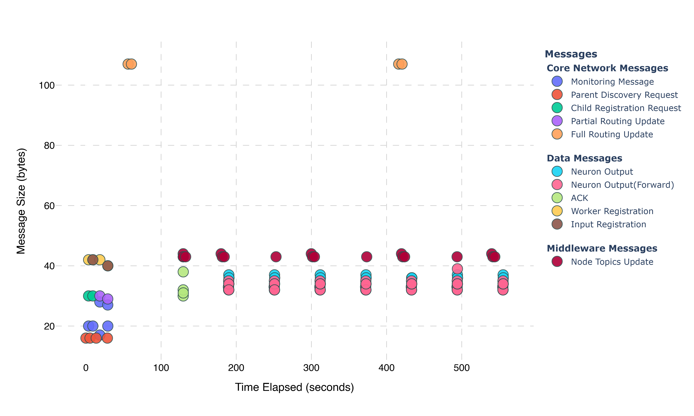
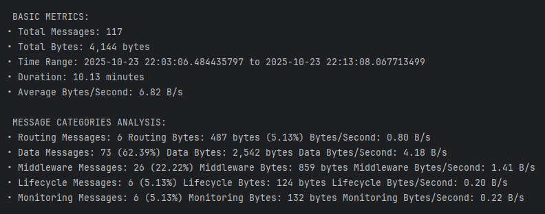
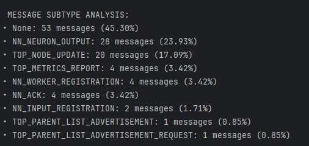
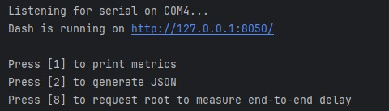

# Network Monitoring Tool

The network monitoring tool operates alongside [HERMES](https://github.com/jequinhatavares/HERMES/tree/master) and provides a real-time view of network topology formation.
In addition, the program monitors key network metrics, offering insight into system performance, communication patterns, and overall network behavior. 
This facilitates debugging, analysis, and a deeper understanding of the system operation.


## ⚙️ How Does It Work?

The Network Monitoring Tool operates by reading the serial output from the root node, which acts as the primary data source for the system. 
For this reason, the root node must be physically connected to the computer running the tool.

On the firmware side, the HERMES library provides a modular logging system composed of multiple logging modules. The Network Monitoring Tool relies on a dedicated module, `MONITORING_MODULE`, which must be explicitly enabled.
When this module is active, the system outputs all messages associated with it to the serial interface. 
These messages are defined using a specific message type, `MONITORING`, which serves to clearly distinguish monitoring data from other system prints.
All `MONITORING` messages follow a structured format and contain the relevant information required for network analysis, such as node events, topology changes, and performance metrics.

The tool continuously listens to the serial stream and filters out messages of this type. 
Once identified, these messages are parsed according to their predefined format, extracting key information such as node identifiers, timestamps, and network events.

After parsing, the data is stored in JSON files, organized sequentially by experiment. 
Each experiment dataset includes metrics such as network join events, parent recovery behavior, traffic distribution by message type, and distributed neural network activity.
### Monitoring Messages

The following section describes the set of `MONITORING` messages generated by HERMES and interpreted by the tool:
- `NEW_NODE` (0): Notifies the system when a new node joins the network.
- `DELETED_NODE` (1): Indicates that a node has left the network or become unreachable.
- `CHANGE_PARENT` (2): Reports a change in a node’s parent, reflecting topology updates.
- `LIFECYCLE_TIMES` (3): Provides timing metrics related to node startup and lifecycle states.
- `PARENT_RECOVERY_TIME` (4): Measures the time required for a node to reconnect after losing its parent.
- `MESSAGES_BATCHED` (5): Tracks aggregated message statistics for traffic analysis.
- `MESSAGES_CONTINUOUS` (6): Tracks continuous message statistics for traffic analysis.
- `END_TO_END_DELAY` (7): Provides measurements of round-trip latency between nodes.
- `APP_LEVEL` (8): Contains application-level metrics specific to higher-level functionality. 
This category is designed to be customizable depending on the deployed application. 
In the current implementation, these metrics are related to the distributed neural network (NN) inference application.


## 📊 Output Examples

The following images show examples of plots generated from data parsed by the Network Monitoring Tool.

### Network Integration Metrics

<p align="center">
  
</p>

### Messages received over time, categorized by message type

<p align="center">
  
  
</p>

### Message Analysis

<p align="center">
  
  
</p>


## 🚀 How to Run

**Prerequisites**

- The root node of the network must be physically connected to the computer hosting the server.
- Monitoring functionality must be enabled on the microcontrollers running HERMES.  
  This is not configured in this repository — you must enable it in the firmware of each microcontroller that uses the HERMES library by adding:

```cpp
enableModule(MONITORING_SERVER);
```

**Setup**

1. Install dependencies
```bash
pip install -r requirements.txt
```
2. Update the code to set the correct COM port where the root node is connected.


**Run the Tool**

After completing the setup, start the program. It will automatically begin monitoring the network and displaying the topology in real time.
Once initialized, a command-line interface (CLI) will appear with the following options:

- Press `1` to display the metrics collected so far.
- Press `2` to generate a JSON file containing the collected metrics.
- Press `8` to instruct the root node to send messages to each node in the network, enabling the measurement of Round Trip Time (RTT).

<p align="center">
  
</p>